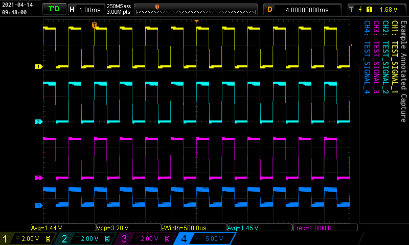

# WORK IN PROGRESS
I have forked the [original repo](https://github.com/RoGeorge/DS1054Z_screen_capture) and am currently in the progress of updating it.  Much of the "User Manaul" text below is now out of date.

The original repo has not been touched in 4 years and appears to be languishing.

- **Current state:**
    - The project now supports Python 3.
    - I have no plans to support or test with Python 2.
    - Image annotation has been added and is working (see section below).
    - I have not tested on Windows. The current code base is running on OSX with Python 3.8 using a Rigol DS1054Z.
- **TODO:**
    - The original project contained a long list of "TODO"s in `OscScreenGrabLAN.py`.  I have not reviewed them or assessed my likelihood of taking them on.
    - Add license file for the annotation font (`Inconsolata-SemiBold.ttf`, from Google fonts).
    - General code cleanup / refactoring.

Usage:
```
$ ./OscScreenGrabLAN.py --help
Usage: OscScreenGrabLAN.py [OPTIONS] [HOSTNAME] filename

  Take screen captures from DS1000Z-series oscilloscopes.

  hostname: Hostname or IP address of the oscilloscope.  If not supplied
            (or the word "default") then the value of "default_hostname"
            from config.json will be used.
  filename: Name of output file.

  Passing the --csv flag will save the capture samples as a CSV file. If the
  --csv flag is NOT passed, then a screenshot (.png) will be saved.

Options:
  -n, --note TEXT    Note label.
  -1, --label1 TEXT  Channel 1 label.
  -2, --label2 TEXT  Channel 2 label.
  -3, --label3 TEXT  Channel 3 label.
  -4, --label4 TEXT  Channel 4 label.
  -r, --raw          Save raw image (with no annotation or de-cluttering)
  -c, --csv          Save scope data as csv.
  -d, --debug        Enable debug logging.
  --help             Show this message and exit.

$
```
# DS1054Z_screen_capture

`OscScreenGrabLAN.py` is a Python script that captures
whatever is displayed on the screen of a Rigol DS1000Z series oscilloscope.

It can save data as a WYSIWYG (What You See Is What You Get) picture of the oscilloscope screen,
 or as a text file in CSV (Comma Separated Values) format.

To achieve this, SCPI (Standard Commands for Programmable Instruments) are sent from the computer
to the oscilloscope, using the LXI (LAN-based eXtensions for Instrumentation) protocol over a Telnet connection.
The computer and the oscilloscope are connected together by a LAN (Local Area Network).
No USB (Universal Serial Bus), no VISA (Virtual Instrument Software Architecture),
no IVI (Interchangeable Virtual Instrument) and no Rigol drivers are required.
Python 2 is required. Python 3 is not supported.

Tested with Windows 10, Python 2.7.12, pillow and Rigol DS1104Z (a fully upgraded DS1054Z oscilloscope).
Tested with Linux Ubuntu 16.04.1, Python 2.7.12 and pillow.


## User Manual:
This program captures either the waveform or the whole screen
    of a Rigol DS1000Z series oscilloscope, then save it on the computer
    as a CSV, PNG or BMP file with a timestamp in the file name.

    The program is using LXI protocol, so the computer
    must have LAN connection with the oscilloscope.
    USB and/or GPIB connections are not used by this software.

    No VISA, IVI or Rigol drivers are needed.
	
Installation:

    Installation on a clean Windows 10 machine
	    1. download and install Python 2.7.12 from https://www.python.org/downloads/
		2. to install pillow, open a Command Prompt and type
		    pip install pillow
		3. download and unzip 'DS1054Z_screen_capture-master.zip' from https://github.com/RoGeorge/DS1054Z_screen_capture
		4. connect the oscilloscope to the LAN (in this example, the oscilloscope have fix IP=192.168.1.3)
		5. in the Command Prompt, change the directory (CD) to the path were 'OscScreenGrabLAN.py' was un-zipped
		    cd path_where_the_OscScreenGrabLAN.py_was_unzipped
		6. to run the OscScreenGrabLAN.py in the Command Prompt, type
		    python OscScreenGrabLAN.py png 192.168.1.3
			
	Installation on a clean Ubuntu 16.04.1
	    1. Python is already installed in Ubuntu 16.04.1 desktop
	    2. to install pillow, open a Terminal and type:
		    sudo add-apt-repository universe
			sudo apt-get update
			sudo apt-get install python-pip
			pip install pillow
		3. download and unzip 'DS1054Z_screen_capture-master.zip' from https://github.com/RoGeorge/DS1054Z_screen_capture
		4. connect the oscilloscope to the LAN (in this example, the oscilloscope have fix IP=192.168.1.3)
		5. in the Terminal, change the directory (CD) to the path were 'OscScreenGrabLAN.py' was un-zipped
		    cd path_where_the_OscScreenGrabLAN.py_was_unzipped
		6. to run the OscScreenGrabLAN.py in the Terminal, type
		    python OscScreenGrabLAN.py png 192.168.1.3			
	
Other usages syntax:

    python OscScreenGrabLAN.py png|bmp|csv oscilloscope_IP

Usage examples:

    python OscScreenGrabLAN.py png 192.168.1.3
    python OscScreenGrabLAN.py csv 192.168.1.3

### Image Annotation

- The following image "clutter" is automatically removed:
    - Left on-screen menu.
    - Right on-screen menu.
    - Upper left RIGOL logo.
    - Lower right status icons (sound, etc.)
- The following annotation is automatically added:
    - Time/Date stamp (Upper left)
- The following annotations are optionally added:
    - Note (`-n` option)
    - Signal Names (options `-1`, `-2`, `-3`, `-4`)

### Example Annotation
`OscScreenGrabLAN.py -1 TEST_SIGNAL_1 -2 TEST_SIGNAL_2 -3 TEST_SIGNAL_3 -4 TEST_SIGNAL_4 -n "Example Annotated Capture"`



## Licenses
### Source
GPL
### Font
The font [Inconsolata-SemiBold.ttf](https://fonts.google.com/specimen/Inconsolata#about) comes from Google Fonts, and is licensed under the [Open Font License](https://scripts.sil.org/cms/scripts/page.php?site_id=nrsi&id=OFL).

You can use it freely in your products & projects - print or digital, commercial or otherwise. However, you can't sell the font on its own.

This isn't legal advice, please consider consulting a lawyer and see the full license for all details.